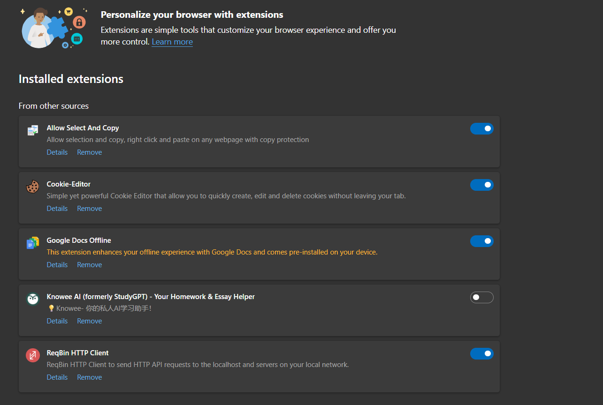
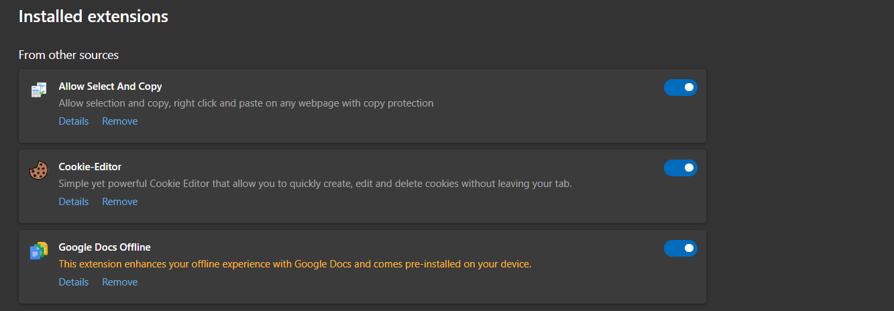

# 🧩 Cyber Security Internship – Task 7  
## Identify and Remove Suspicious Browser Extensions  

---

### 🧭 Objective  
To identify, analyze, and remove potentially harmful browser extensions in Microsoft Edge that may affect privacy, performance, or security.

---

### 🧰 Tools Used  
- Microsoft Edge  
- Extensions Manager → `edge://extensions/`  
- Manual permission and review checks  
- Google for background research  

---

### 🧾 Steps Followed  

1. **Opened Extensions Manager**  
   Navigated to `edge://extensions/` to view all installed extensions.  

2. **Reviewed Each Extension**  
   Checked developer name, permissions, and reviews from the Edge Add-ons store.  

3. **Identified Suspicious Extensions**  
   Marked those requesting unnecessary access (like reading all site data).  

4. **Removed / Disabled Untrusted Extensions**  
   - Removed or disabled extensions that were not from verified sources.  

5. **Restarted Browser and Verified Performance**  
   Confirmed that Edge ran smoother after cleanup.  

---

### 📋 Extensions Analyzed  

| Extension Name | Developer / Source | Status | Risk / Observation | Action Taken |
|----------------|--------------------|---------|--------------------|--------------|
| **Allow Select And Copy** | Third-party | ⚠️ Suspicious | Bypasses webpage protections; may inject scripts. | **Removed** |
| **Cookie-Editor** | Third-party | ⚠️ Moderate Risk | Can read/edit/delete cookies; use only when needed. | **Kept (Occasional Use)** |
| **Google Docs Offline** | Google LLC | ✅ Safe | Official Google extension; verified. | **Kept** |
| **Knowee AI (formerly StudyGPT)** | Unknown | ⚠️ Potential Risk | Requests page-data access; unverified source. | **Disabled** |
| **ReqBin HTTP Client** | ReqBin LLC | ⚠️ Technical Risk | Developer tool; may expose network info if misused. | **Kept (for development)** |

---

### 🧩 Before and After Cleanup  

#### 📸 Installed Extensions (Before)  

#### 📸 Extensions After Cleanup  

---

### 🧠 Learnings  
- Review extension permissions before installation.  
- Install only from trusted sources.  
- Disable unused or unverified extensions.  
- Browser performance improves after removing bloatware.  
- Extensions can access sensitive data like cookies or browsing history.  

---

### 💬 Interview Questions  

1. **How can browser extensions pose risks?**  
   ➤ They can read/modify web content or steal user data.  

2. **What permissions raise suspicion?**  
   ➤ “Read and change all your data on all websites.”  

3. **How to install extensions safely?**  
   ➤ Use official stores and verified developers only.  

4. **What is extension sandboxing?**  
   ➤ Isolation technique preventing extensions from accessing system resources directly.  

5. **Can extensions steal passwords?**  
   ➤ Yes, malicious ones can capture keystrokes or cookies.  

6. **How to update securely?**  
   ➤ Enable automatic updates from verified sources only.  

7. **Difference between extensions and plugins?**  
   ➤ Extensions modify browser behavior; plugins handle specific content (e.g., PDF viewers).  

8. **How to report malicious extensions?**  
   ➤ Use “Report abuse” in the Edge Add-ons Store.  

---

### 🧾 Outcome  
✅ Identified and removed suspicious extensions.  
✅ Improved awareness of browser-level security.  
✅ Gained hands-on experience in permissions analysis and threat mitigation.  

---

**Author:** *Aashutosh Rana*  

